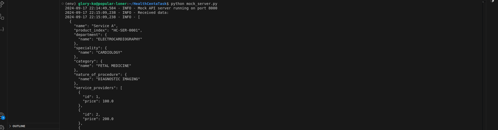

# HealthCenta Data Processing

This project processes healthcare-related data from an Excel file, transforms it into a specific JSON format, and prepares it for API submission.

## *Setup*

1. Ensure you have *Python 3.7+* installed on your system.

2. Clone this repository:
   
   `git clone https://github.com/GloryKO/HealthCentaTask.git`
   

3. Navigate into the project directory:
   
   `cd HealthCentaTask`
   

4. Create a virtual environment and activate it:

   - *On Linux/macOS*:
     
     `python -m venv env`
     `source env/bin/activate`
     

   - *On Windows*:
     
     `python -m venv env`
     `env\Scripts\activate`
     

5. Install the required packages:
   
   `pip install -r requirements.txt`
   

---

## *Usage*

1. Place your Excel file in the project directory.

2. Run the scripts:
   - First, start the mock server by opening your terminal and running the command below:
     `python mock_server.py`
    this starts the server locally on port 8000 (this is very important as the main file is dependent on the server running)
     
    - Update the file_path variable in main.py to point to your Excel file path, 
    - uncomment the call to main function 
    - open a different terminal and run the main processing script using the following command:
      `python main.py`

      # OR 
      
      specify the file path directly in the main terminal and run the main file with `python main.py /path/to/your/excel/file.xls http://localhost:8000` (make sure to replace  /path/to/your/excel/file.xls with your actual file path) 

3. The processed JSON data will be printed to the server terminal(where you run the mock_server file).
---

## *How It Works*

- *read_excel_file()*: Reads the Excel file using pandas.
  
- *clean_data()*: Removes any rows with missing values or duplicates.

- *transform_data()*: Converts the DataFrame into the required JSON structure.

- *generate_json()*: Converts the transformed data into a JSON data.

- *send_to_server()*: Sends the JSON data to a mock server.

The main() function orchestrates these steps by calling the other functions from utils.py.

---

## *Notes*
 - I made specifying the file path in the terminal and running the main file the default as file paths will be different for users:
        run this to start the main file
        `python main.py /path/to/your/excel/file.xls http://localhost:8000` (where /path/to/your/excel/file.xls should be replaced with your actual file path)

- The script includes *error handling* for file reading and data processing.
- I've added logs and removed prints statements as much as possible
- A *mock server* has been set up to simulate how this data might be submitted to an endpoint.
- the data is sent to the mock server and data is displayed in the server terminal
- use ctr +c to stop the server in the mock_server terminal
        